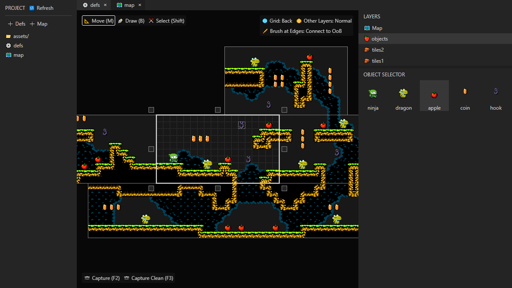
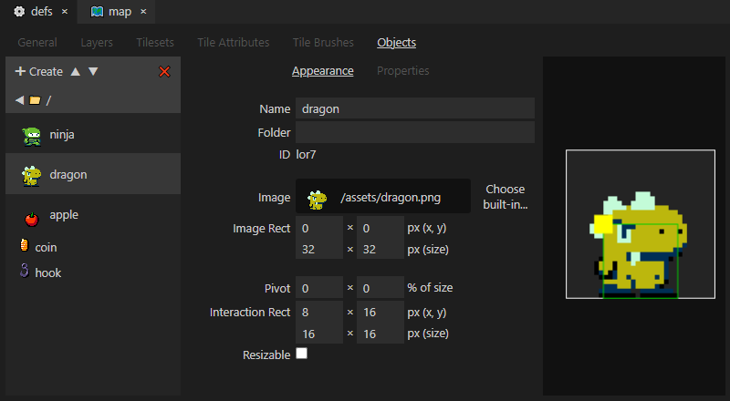
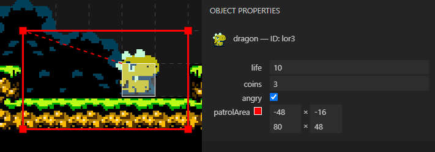

    
# Mapvania

*Mapvania* is a level editor for games! Designed to be easy to set up, with built-in example assets, it naturally saves files in JSON format, so it's easy to integrate into your game engine!

[🖥️ Try it right now on your browser!](https://hlorenzi.github.io/mapvania/)

[![Discord][badge-discord-img]][badge-discord-url]

[badge-discord-img]: https://img.shields.io/discord/394999035540275222?label=Join%20the%20Discord%20server!&logo=discord
[badge-discord-url]: https://discord.com/invite/pXeDXGD


## Features

- 🖥️ ***Browser-based***: Edit local files through the [File System Access API] on supported browsers! If you access the app through the official page above, no installation is required, and the app is always up-to-date with the latest features. You can also download it and run from source locally — see below.

[File System Access API]: https://wicg.github.io/file-system-access/



- ⚙️ ***Project-oriented***: All asset definitions are centralized in a "defs" file, so the level designer always sees the same set of tilesets and objects to use, no matter how many maps they create. Created a new object asset? It's readily available in all map files, new and old. You can also create multiple defs files for different folders in your project, in case you also have to design, for example, level select screens alongside your actual levels.

- 🚪 ***Room-based***: Create an unlimited number of rooms within each map! Move them around, easily expand their boundaries, match their borders, and effortlessly create an interconnected world!

- 🗃️ ***Layer-based***: Define multiple tileset or object layers in your project file to better organize level development! All map files — and the rooms within — will then use the same set of layers, so you have a predictable layout to your levels.

- 🧱 ***Tileset-based***: Load an image file, quickly set up a tile grid, and go on to create vast environments! Use tile brushes to speed up level building, with tile variations for edges and corners selected automatically. Apply attributes to individual tiles, and have your game refer to this information for straightforward collision maps and hazards!



- 🍎 ***Object-based***: Create specialized entities that can each have a deep set of customizable properties! Edit the number of coins spawned by a treasure chest, draw a path for a floating platform's movement, or define a rectangle for an enemy's patrol area!


## Running from source

Clone the repository, then execute:

```
npm run build
npm start
```

Navigate to `http://127.0.0.1`, and there you go!

To experiment with the source code, you can instead execute `npm run dev` in parallel with `npm start`, which will automatically rebuild the necessary app files with every code change.